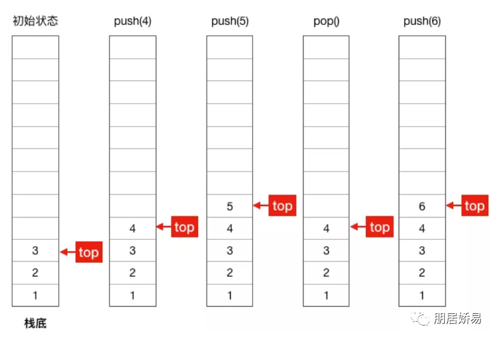
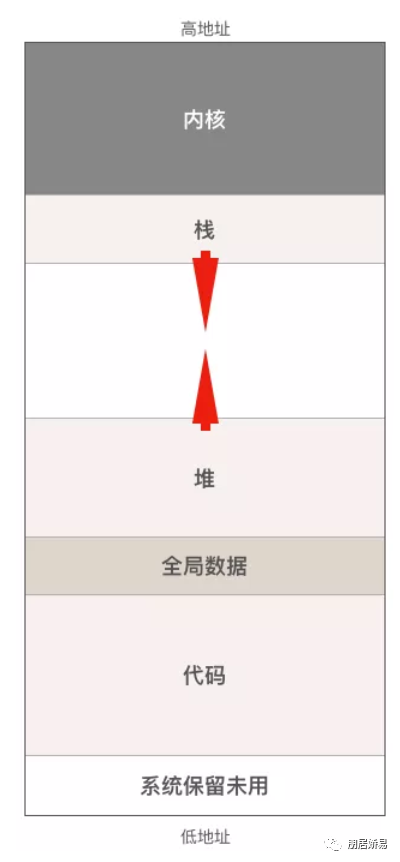

# golang汇编

> Go使用了plan9汇编。plan9和x86汇编有一些区别

## 基本指令

### 栈调整

intel汇编提供了push和pop指令族，plan9虽然有，但是一般生成的代码中没有，看到的栈调整是对硬件SP寄存器镜像运算来实现的
```go
SUBQ $0x18, SP // 对SP做减法，为函数分配函数栈帧
...
ADDQ $0x18, SP // 对SP做加法，清除函数堆栈
```

### 数据搬运

常数在plan9汇编用$num表示，可以为负数，默认情况为十进制。可以用$0x123的形式来表示十六进制数。
```go
MOVB $1, DI    // 1 byte
MOVW $0x10, BX // 2 bytes
MOVD $1, DX    // 4 bytes
MOVQ $-10, AX  // 8 bytes
```

plan9的汇编的操作数的方向是和intel汇编相反的
```go
MOVQ $0x10, AX ====== mov rax, 0x10
```
### 常见计算指令
```go
ADDQ  AX, BX // BX += AX
SUBQ  AX, BX // BX -= AX
IMULQ AX, BX // BX *= AX
```
类似数据搬运指令，同样可以通过修改指令后缀来对应不同长度的操作数。例如ADDQ/ADDW/ADDL/ADDB

### 条件跳转/无条件跳转

```go
// 无条件跳转
JMP addr   // 跳转到地址，地址可为代码中的地址，不过实际上手写不会出现这种东西
JMP label  // 跳转到标签，可以跳转到同一函数内的标签位置
JMP 2(PC)  // 以当前指令为基础，向前/后跳转 x 行
JMP -2(PC) // 同上

// 有条件跳转
JZ target // 如果 zero flag 被set过， 则跳转
```

## 寄存器

| X64 | rax | rbx| rcx | rdx | rdi | rsi | rbp | rsp | r8 | r9 | r10 | r11 | r12 | r13 | r14 | rip|
|--|--|--|--| --| --|--| --|--|--|--|--|--|--|--|--|--|
| Plan9 | AX | BX | CX | DX | DI | SI | BP | SP | R8 | R9 | R10 | R11 | R12 | R13 | R14 | PC |

### 伪寄存器

Go的汇编引入了4个伪寄存器

```go
FP: Frame pointer: arguments and locals.
PC: Program counter: jumps and branches.
SB: Static base pointer: global symbols.
SP: Stack pointer: the highest address within the local stack frame.
```

> 补充说明

+ FP：使用形如 symbol+offset(FP)的方式，引用函数的输入参数。例如arg0+0(FP), arg1+8(FP),使用FP不加symbol时，无法通过编译，在汇编层面来讲，symbol并没有什么用，加symbol主要是为了提升代码可读性。另外，官方文档将FP称为frame point，实际上体根本不是frame point，按照x86来说，frame point应该是指向整个stack frame底部的BP寄存器。假如当前的 callee 函数是 add，在 add 的代码中引用 FP，该 FP 指向的位置不在 callee 的 stack frame 之内，而是在 caller 的 stack frame 上。


+ PC: 实际上就是在体系结构的知识中常见的 pc 寄存器，在 x86 平台下对应 ip 寄存器，amd64 上则是 rip。除了个别跳转之外，手写 plan9 代码与 PC 寄存器打交道的情况较少。


+ SB: 全局静态基指针，一般用来声明函数或全局变量，在之后的函数知识和示例部分会看到具体用法。


+ SP: plan9 的这个 SP 寄存器指向当前栈帧的局部变量的开始位置，使用形如 symbol+offset(SP) 的方式，引用函数的局部变量。offset 的合法取值是 [-framesize, 0)，注意是个左闭右开的区间。假如局部变量都是 8 字节，那么第一个局部变量就可以用 localvar0-8(SP) 来表示。这也是一个词不表意的寄存器。与硬件寄存器 SP 是两个不同的东西，在栈帧 size 为 0 的情况下，伪寄存器 SP 和硬件寄存器 SP 指向同一位置。手写汇编代码时，如果是 symbol+offset(SP) 形式，则表示伪寄存器 SP。如果是 offset(SP) 则表示硬件寄存器 SP。务必注意。对于编译输出(go tool compile -S / go tool objdump)的代码来讲，目前所有的 SP 都是硬件寄存器 SP，无论是否带 symbol。

## 变量声明

在汇编里所谓的变量，一般是存储在.rodata或者.data段中的只读值。对应到应用层的话。就是已初始化过的全局的const、var、static 变量/常量

使用DATA结合GLOBL来定义一个变量。DATA的用法为
```go
DATA symbol+offset(SB)/width, value
```
大多数参数都是字面意思，不过这个offset需要稍微注意。其含义是该值相对于符号symbol的偏移，而不是相对于全局某个地址的偏移。

使用GLOBL指令将变量声明为global，额外接收两个参数，一个是flag，一个是变量的总大小
```go
GLOBL divtab(SB), RODATA, $64
```
GLOBL必须跟在DATA指令之后，下面是一个定义多个readonly的全局变量的完整例子
```go
DATA age+0x00(SB)/4, $18  // forever 18
GLOBL age(SB), RODATA, $4

DATA pi+0(SB)/8, $3.1415926
GLOBL pi(SB), RODATA, $8

DATA birthYear+0(SB)/4, $1988
GLOBL birthYear(SB), RODATA, $4
```
正如之前所说，所有符号在声明时，其 offset 一般都是 0。

有时也可能会想在全局变量中定义数组，或字符串，这时候就需要用上非 0 的 offset 了，例如:

```go
DATA bio<>+0(SB)/8, $"oh yes i"
DATA bio<>+8(SB)/8, $"am here "
GLOBL bio<>(SB), RODATA, $16
```
大部分都好理解，这里引入了新的标记<>,这个跟在符号名之后，表示该全局变量只在当前文件中生效，类似于C语言中的static。如果在另外文件中引用该变量的话，会报relocation target not found的错误

### flag
```go
NOPROF = 1
(For TEXT items.) Don't profile the marked function. This flag is deprecated.
DUPOK = 2
It is legal to have multiple instances of this symbol in a single binary. The linker will choose one of the duplicates to use.
NOSPLIT = 4
(For TEXT items.) Don't insert the preamble to check if the stack must be split. The frame for the routine, plus anything it calls, must fit in the spare space at the top of the stack segment. Used to protect routines such as the stack splitting code itself.
RODATA = 8
(For DATA and GLOBL items.) Put this data in a read-only section.
NOPTR = 16
(For DATA and GLOBL items.) This data contains no pointers and therefore does not need to be scanned by the garbage collector.
WRAPPER = 32
(For TEXT items.) This is a wrapper function and should not count as disabling recover.
NEEDCTXT = 64
(For TEXT items.) This function is a closure so it uses its incoming context register.
```
使用flag的字面量，需要在汇编文件中 `#include "textflag.h"`

## .s和.go文件的全局变量互通
在.s文件中是可以直接使用.go中定义的全局变量

refer.go
```go
package main

var a = 999
func get() int

func main() {
    println(get())
}

```
refer.s
```go
#include "textflag.h"

TEXT ·get(SB), NOSPLIT, $0-8
    MOVQ ·a(SB), AX
    MOVQ AX, ret+0(FP)
    RET
```
·a(SB)，表示该符号需要链接器来帮我们进行重定向(relocation)，如果找不到该符号，会输出 relocation target not found 的错误。

## 函数声明
我们来看看一个典型的plan9的汇编函数的定义：
```go
// func add(a, b int) int
// => 该声明定义在同一个package下的任意.go文件中
// => 只有函数头，没有实现
TEXT pkgname·add(SB), NOSPLIT, $0-8
    MOVQ a+0(FP), AX
    MOVQ b+8(FP), BX
    ADDQ AX, BX
    MOVQ BX, ret+16(FP)
    RET
```
为什么要叫TEXT？如果对程序数据在文件中和内存中的分段稍有了解的同学应该知道，我们的代码在二进制文件中，是存储在.text段中的，这里也就是一种约定俗成的起名方式。实际在plan9中TEXT是一个指令，用来定义一个函数。除了TEXT之外还有之前的DATA/GLOBL.

定义中的pkgname可以省略

中点 · 比较特殊，是一个 unicode 的中点，该点在 mac 下的输入方法是 option+shift+9。在程序被链接之后，所有的中点· 都会被替换为句号.，比如你的方法是 runtime·main，在编译之后的程序里的符号则是 runtime.main。嗯，看起来很变态。简单总结一下:

```go

                              参数及返回值大小
                                  | 
 TEXT pkgname·add(SB),NOSPLIT,$32-32
       |        |               |
      包名     函数名         栈帧大小(局部变量+可能需要的额外调用函数的参数空间的总大小，但不包括调用其它函数时的 ret address 的大小)

```

## 栈结构

函数的栈结构图
```
                                                                                   
                       -----------------                                           
                       current func arg0                                           
                       ----------------- <----------- FP(pseudo FP)                
                        caller ret addr                                            
                       +---------------+                                           
                       | caller BP(*)  |                                           
                       ----------------- <----------- SP(pseudo SP，实际上是当前栈帧的 BP 位置)
                       |   Local Var0  |                                           
                       -----------------                                           
                       |   Local Var1  |                                           
                       -----------------                                           
                       |   Local Var2  |                                           
                       -----------------                -                          
                       |   ........    |                                           
                       -----------------                                           
                       |   Local VarN  |                                           
                       -----------------                                           
                       |               |                                           
                       |               |                                           
                       |  temporarily  |                                           
                       |  unused space |                                           
                       |               |                                           
                       |               |                                           
                       -----------------                                           
                       |  call retn    |                                           
                       -----------------                                           
                       |  call ret(n-1)|                                           
                       -----------------                                           
                       |  ..........   |                                           
                       -----------------                                           
                       |  call ret1    |                                           
                       -----------------                                           
                       |  call argn    |                                           
                       -----------------                                           
                       |   .....       |                                           
                       -----------------                                           
                       |  call arg3    |                                           
                       -----------------                                           
                       |  call arg2    |                                           
                       |---------------|                                           
                       |  call arg1    |                                           
                       -----------------   <------------  hardware SP 位置           
                         return addr                                               
                       +---------------+                                           
                                                                                   
```

 caller 直接翻译为调用者，callee 翻译为被召者。


 从原理上来讲，如果当前函数调用了其他函数，那么return addr 也是在caller的栈上的，不过往栈上插return addr 的过程是由CALL指令完成的，在RET中,SP又会恢复到图上位置。我们在计算SP和参数相对位置时，可以认为硬件SP指向的就是图上的位置

 图上的 caller BP，指的是 caller 的 BP 寄存器值，有些人把 caller BP 叫作 caller 的 frame pointer，实际上这个习惯是从 x86 架构沿袭来的。Go 的 asm 文档中把伪寄存器 FP 也称为 frame pointer，但是这两个 frame pointer 根本不是一回事。

此外需要注意的是，caller BP 是在编译期由编译器插入的，用户手写代码时，计算 frame size 时是不包括这个 caller BP 部分的。是否插入 caller BP 的主要判断依据是:

1. 函数的栈帧大小大于0
2. 下述函数返回true

如果编译器在最终的汇编结果中没有插入caller BP（源代码中所称的frame pointer）的情况下，伪SP和伪FP之间只有8个字节的caller的return address，而插入了BP的话，就会多出额外的8字节。也就是说伪SP和伪FP的相对位置时不固定的，有可能是间隔8个字节，也有可能间隔16字节。并且判断依据会根据平台和Go的版本有所不同

图上可以看到，FP伪寄存器指向函数的传入参数的开始位置，因为栈是朝低地址方向增长，为了通过寄存器引用参数时方便，所以参数的摆放方向和栈的增长方向是相反的
```go
                              FP
high ----------------------> low
argN, ... arg3, arg2, arg1, arg0
```
假设所有参数均为8字节，这样我们就可以用symname+0(FP)访问第一个参数，以此类推。用伪 SP 来引用局部变量，原理上来讲差不多，不过因为伪 SP 指向的是局部变量的底部，所以 symname-8(SP) 表示的是第一个局部变量，symname-16(SP)表示第二个，以此类推。当然，这里假设局部变量都占用 8 个字节。

图上的最上部的caller return address 和 current func arg0 都是由caller来分配空间的。不算在当前的栈帧内。

因为官方文档本身较模糊，我们来一个函数调用的全景图，来看一下这些真假 SP/FP/BP 到底是个什么关系:

```go
                                                                                                                              
                                       caller                                                                                 
                                 +------------------+                                                                         
                                 |                  |                                                                         
       +---------------------->  --------------------                                                                         
       |                         |                  |                                                                         
       |                         | caller parent BP |                                                                         
       |           BP(pseudo SP) --------------------                                                                         
       |                         |                  |                                                                         
       |                         |   Local Var0     |                                                                         
       |                         --------------------                                                                         
       |                         |                  |                                                                         
       |                         |   .......        |                                                                         
       |                         --------------------                                                                         
       |                         |                  |                                                                         
       |                         |   Local VarN     |                                                                         
                                 --------------------                                                                         
 caller stack frame              |                  |                                                                         
                                 |   callee arg2    |                                                                         
       |                         |------------------|                                                                         
       |                         |                  |                                                                         
       |                         |   callee arg1    |                                                                         
       |                         |------------------|                                                                         
       |                         |                  |                                                                         
       |                         |   callee arg0    |                                                                         
       |                         ----------------------------------------------+   FP(virtual register)                       
       |                         |                  |                          |                                              
       |                         |   return addr    |  parent return address   |                                              
       +---------------------->  +------------------+---------------------------    <-------------------------------+         
                                                    |  caller BP               |                                    |         
                                                    |  (caller frame pointer)  |                                    |         
                                     BP(pseudo SP)  ----------------------------                                    |         
                                                    |                          |                                    |         
                                                    |     Local Var0           |                                    |         
                                                    ----------------------------                                    |         
                                                    |                          |                                              
                                                    |     Local Var1           |                                              
                                                    ----------------------------                            callee stack frame
                                                    |                          |                                              
                                                    |       .....              |                                              
                                                    ----------------------------                                    |         
                                                    |                          |                                    |         
                                                    |     Local VarN           |                                    |         
                                  SP(Real Register) ----------------------------                                    |         
                                                    |                          |                                    |         
                                                    |                          |                                    |         
                                                    |                          |                                    |         
                                                    |                          |                                    |         
                                                    |                          |                                    |         
                                                    +--------------------------+    <-------------------------------+         
                                                                                                                              
                                                              callee
```

### argsize和framesize计算规则

argsize

在函数声明中：
```go
TEXT pkgname·add(SB),NOSPLIT,$16-32
```

前面已经说过 $16-32 表示 $framesize-argsize。Go 在函数调用时，参数和返回值都需要由 caller 在其栈帧上备好空间。callee 在声明时仍然需要知道这个 argsize。argsize 的计算方法是，参数大小求和+返回值大小求和，例如入参是 3 个 int64 类型，返回值是 1 个 int64 类型，那么这里的 argsize = sizeof(int64) * 4。

不过真实世界永远没有我们假设的这么美好，函数参数往往混合了多种类型，还需要考虑内存对齐问题。

如果不确定自己的函数签名需要多大的 argsize，可以通过简单实现一个相同签名的空函数，然后 go tool objdump 来逆向查找应该分配多少空间。

framesize
函数的 framesize 就稍微复杂一些了，手写代码的 framesize 不需要考虑由编译器插入的 caller BP，要考虑：

局部变量，及其每个变量的 size。
在函数中是否有对其它函数调用时，如果有的话，调用时需要将 callee 的参数、返回值考虑在内。虽然 return address(rip)的值也是存储在 caller 的 stack frame 上的，但是这个过程是由 CALL 指令和 RET 指令完成 PC 寄存器的保存和恢复的，在手写汇编时，同样也是不需要考虑这个 PC 寄存器在栈上所需占用的 8 个字节的。
原则上来说，调用函数时只要不把局部变量覆盖掉就可以了。稍微多分配几个字节的 framesize 也不会死。
在确保逻辑没有问题的前提下，你愿意覆盖局部变量也没有问题。只要保证进入和退出汇编函数时的 caller 和 callee 能正确拿到返回值就可以。


## 函数调用栈

> 栈：是一种 先进后出 的数据结构，相当于一个容器

当需要往容器添加元素时，只能放在最上面元素之上，取出元素时，也只能从最上面的元素开始往外取，通常将添加操作称为入栈（push），取出操作称为出栈（pop）



进程在内存中的布局，严格来说进程在虚拟地址空间中的布局

操作系统把磁盘上的可执行文件加载到内存之前，会做很多工作。最主要的一个环节就是把可执行文件中的代码、数据放在内存中合适的位置上，并分配和初始化程序运行中所必须的堆和栈，当所有操作完成后，操作系统才会调度程序运行起来

程序运行时在内存中的布局



进程在内存中布局主要分为四个部分：代码区、数据区、堆和栈，除开栈其他部分

+ 代码区 包括能被CPU执行的机器代码（指令）和只读数据（比如字符串常量），当程序加载完毕后，代码区大小不会再进行变化
+ 数据区 包括程序的全局变量和静态变量（C有，Go没有），与代码区一样，当程序加载完毕后，代码区大小不会再进行变化
+ 堆 程序运行时动态分配的内存都位于堆中，这部分内存由内存分配器进行管理

堆大小随程序运行而进行改变，也就是说，当向堆请求分配内存，但内存分配器发现堆内存不足时，内存分配器会向操作系统内核申请向高地址方向扩展堆的大小，反之当释放内存将其归还于堆时，如果内存分配器发现空闲内存太多，则会向操作系统内核请求向低地址方向收缩堆的大小

### 栈

程序运行过程，不管是函数的执行还是调用，栈都起着非常重要的作用，用途

1. 保存函数的局部变量
2. 向被调用函数传递参数
3. 返回函数的返回值
4. 保存函数的返回地址

返回地址： 从被调用函数返回后调用者应该继续执行的指令在内存中的地址

每个函数在执行过程中都需要用栈来保存上述的值，此时被使用的栈就称为这个函数的栈帧（stack frame）

当函数发生调用时，因为调用者还没有执行完，其栈中保存的数据还有用，所以被调用的函数不能覆盖调用者的栈帧，只能把调用函数层级的增长而生长，随着函数的返回而缩小，可以理解为，函数调用层级越深，消耗栈空间就越大

参考文章

https://blog.csdn.net/luyaran/article/details/120555863

https://zhuanlan.zhihu.com/p/509152553


## 地址运算

地址运算也是lea指令，英文Load Effective Address，amd64平台地址都是8字节，所以直接使用LEAQ就好
```go
LEAQ (BX)(AX*8), CX
// 上面代码中 8 代表 scale
// scale 只能是 0、2、4、8
// 如果写成其他值：
// LEAQ (BX)(AX*3), CX
// ./a.s:6 bad scale:3

// 用LEAQ的话，即使是两个寄存器值直接相加，也必须提供scale
// 下面这样是不行的
// LEAQ(BX)(AX), CX
// asm: asmidx: bad address 0/2064/2067
// 正确的写法是
LEAQ (BX)(AX*1), CX

// 在寄存器运算的基础上，可以加上额外的 offset
LEAQ 16(BX)(AX*1), CX

// 三个寄存器做运算，还是别想了
// LEAQ DX(BX)(AX*8), CX
// ./a.s:13: expected end of operand, found (
```

### 示例

math.go:
```go
package main

import "fmt"

func add(a, b int) int // 汇编函数声明

func sub(a, b int) int // 汇编函数声明

func mul(a, b int) int // 汇编函数声明

func main() {
    fmt.Println(add(10, 11))
    fmt.Println(sub(99, 15))
    fmt.Println(mul(11, 12))
}
```

math.s:
```go
#include "textflag.h" // 因为我们声明函数用到了 NOSPLIT 这样的 flag，所以需要将 textflag.h 包含进来

// func add(a, b int) int
TEXT ·add(SB), NOSPLIT, $0-24
    MOVQ a+0(FP), AX // 参数 a
    MOVQ b+8(FP), BX // 参数 b
    ADDQ BX, AX    // AX += BX
    MOVQ AX, ret+16(FP) // 返回
    RET

// func sub(a, b int) int
TEXT ·sub(SB), NOSPLIT, $0-24
    MOVQ a+0(FP), AX
    MOVQ b+8(FP), BX
    SUBQ BX, AX    // AX -= BX
    MOVQ AX, ret+16(FP)
    RET

// func mul(a, b int) int
TEXT ·mul(SB), NOSPLIT, $0-24
    MOVQ  a+0(FP), AX
    MOVQ  b+8(FP), BX
    IMULQ BX, AX    // AX *= BX
    MOVQ  AX, ret+16(FP)
    RET
    // 最后一行的空行是必须的，否则可能报 unexpected EOF
```

### 伪寄存器SP、伪寄存器FP和硬件寄存器SP

伪 SP、伪 FP 和硬件 SP 的位置关系。 spspfp.s:

```go
#include "textflag.h"

// func output(int) (int, int, int)
TEXT ·output(SB), $8-48
    MOVQ 24(SP), DX // 不带 symbol，这里的 SP 是硬件寄存器 SP
    MOVQ DX, ret3+24(FP) // 第三个返回值
    MOVQ perhapsArg1+16(SP), BX // 当前函数栈大小 > 0，所以 FP 在 SP 的上方 16 字节处
    MOVQ BX, ret2+16(FP) // 第二个返回值
    MOVQ arg1+0(FP), AX
    MOVQ AX, ret1+8(FP)  // 第一个返回值
    RET

```

spspfp.go:

```go
package main

import (
    "fmt"
)

func output(int) (int, int, int) // 汇编函数声明

func main() {
    a, b, c := output(987654321)
    fmt.Println(a, b, c)
}

// output

987654321 987654321 987654321
```
当前栈结构

```go
------
ret2 (8 bytes)
------
ret1 (8 bytes)
------
ret0 (8 bytes)
------
arg0 (8 bytes)
------ FP
ret addr (8 bytes)
------
caller BP (8 bytes)
------ pseudo SP
frame content (8 bytes)
------ hardware SP
```

## 总结

|操作|说明|
|-|-|
|INCL AX| 操作数宽度(L双字，Q四字)|
|MOVL CX, AX| 操作数顺序，CX赋值给AX|
|[ESP+EBX*2+16] => 16(SP)(BX*2)| 地址的表示|
|MOVL $123, AX|立即数 $数字|